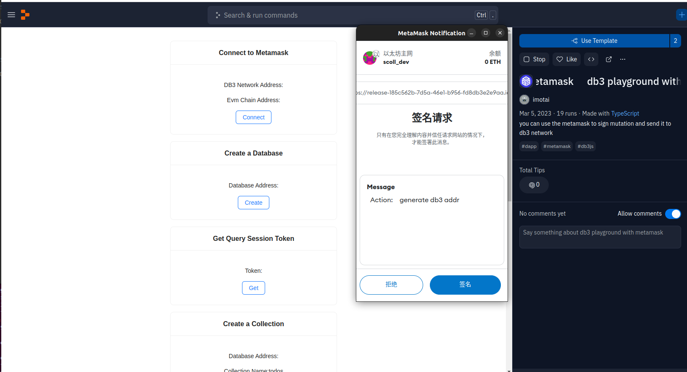
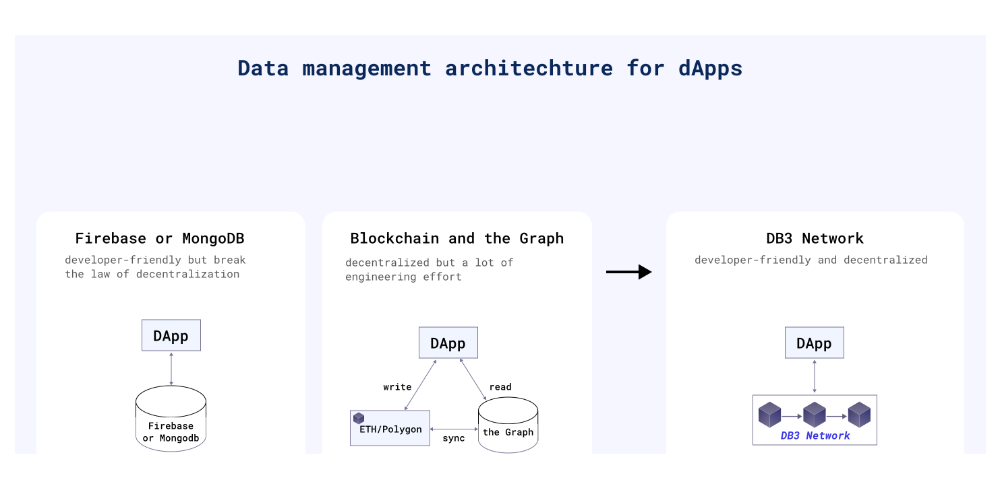

<p align="center">
 
<p align="center"> A ⭐️ is welcome!
  
<p align="center">


[](https://github.com/dbpunk-labs/db3/issues?q=is%3Aopen+is%3Aissue+label%3A%22good+first+issue%22)

[](https://twitter.com/Db3Network)
[](https://www.gitpoap.io/gh/dbpunk-labs/db3)
[](https://discord.gg/sz3bmZx2uh)

**English | [中文](./README_zh_cn.md)**

## DB3 Network

DB3 Network is an open-source and decentralized firebase firestore alternative for building fully decentralized dApps quickly with  minimal engineering effort.

<p align="center">
 

## Demo

[DB3 Network CRUD TodoMVC demo](https://replit.com/@imotai/DB3-Network-CRUD-TodoMVC-Demo?v=1)


[DB3 Network Metamask Support Demo](https://replit.com/@imotai/db3-playground-with-metamask?v=1)



## Getting Started

install db3up tool

```shell
curl --proto '=https' --tlsv1.2 -sSf https://up.db3.network/db3up_init.sh | sh
```

Note:
* curl and python3 are required in your enviroment

Start the localnet
```
db3up localnet
```
Note if you encounter the error 'db3up not found' you use the following solution to resolve it
* You should run the `source ~/.zshrc` if you use zsh or `source ~/.bashrc` if you use bash

You will see the follwoing output
```
start db3 network in single node mode...
start db3 network ok ..
use db3 console to connect to the http://127.0.0.1:26659
ctrl-c to kill the localnet
```


Open another terminal and run the following commands

```
# connect to db3
db3 console
db3>-$ init
 address                                    | scheme
--------------------------------------------+-----------
 0xcc28673faf07ec708d30ca0275f0509279db9242 | secp256k1
db3>-$ new-db
 database address                           | mutation id
--------------------------------------------+----------------------------------------------
 0x658be8968b414830d57e44f9b70ad65d4a947764 | Gm9FOIymAFjmy9NtGWSMZRiAdtV81CGMMNGgIJMk0nY=
```

## Connect to db3 network with db3.js


```typescript

// create a db3 browser wallet 
const mnemonic =
        'result crisp session latin must fruit genuine question prevent start coconut brave speak student dismiss'
const wallet = DB3BrowserWallet.createNew(mnemonic, 'DB3_SECP256K1')

// you can use metamask to connect db3 network with the following code
// const wallet = new MetamaskWallet(window)

// create a database
const [dbId, txId] = await client.createDatabase()

// connect a database with address
const db = initializeDB3('http://127.0.0.1:26659', dbId, wallet)

const indexList: Index[] = [
            {
                name: 'idx1',
                id: 1,
                fields: [
                    {
                        fieldPath: 'owner',
                        valueMode: {
                            oneofKind: 'order',
                            order: Index_IndexField_Order.ASCENDING,
                        },
                    },
                ],
            },
        ]
// create a collection with index and the following interface `Todo`
//
//interface Todo {
//    text: string
//    owner: string
//}
//
const collectionRef = await collection<Todo>(db, 'todos', indexList)

// add a todo
const result = await addDoc<Todo>(collectionRef, {
            text: 'beijing',
            owner: wallet.getAddress(),
 } as Todo)
```
 
the tour on replit.com about how to use db3.js
* [create a database](https://replit.com/@imotai/ConnectToDB3?v=1)


## Why DB3 Network


Currently, there are two types of Data architecture for dApp(decentralized application): centralized vs. decentralized.
  
**Centralized**: use [Firebase](https://firebase.google.com)
 or [MongoDB](https://github.com/mongodb/mongo)to store the data), both of which are developer-friendly. However, dApps would be regarded as less secure based on a central database.
  
**Decentralized**: use Ethereum or other blockchains to store the data and use [the Graph](https://thegraph.com/en/) to index data from it. The separation of the storage and the indexer would cost a lot of engineering efforts in future development.
  
With Db3 network, you can get both advantages of the above two choices.


# Features

**Schemaless**

You can store data on DB3 Network without any change.

**High Performance**

Currently, decentralization means terrible performance, but DB3 is trying to improve it significantly:
* [Merkdb](https://github.com/dbpunk-labs/db3/issues/100) is the storage engine of the DB3 Network, and it has high Performance and fast-proof generation. 
* Geo distribution: the nodes in every storage shard are geo-distributed, and the clients can execute queries against the nearest storage node.
* [Query session](./docs/query.md), the first decentralized query protocol to resolve Performance and incentive perfectly.

**Data Ownership**

We proposed [the document level ownership](https://github.com/dbpunk-labs/db3/issues/271), and every document has its owner, while only the owner holds the private key can update/delete the record. DB3 network generates the proofs and provides signatures to prove the membership (db3 has the specific document) and ownership.

**Programmable**

Dapp developers can develop data processing contracts and deploy them to the DB3 Network, just like the data backend in web2.

**Ethereum Guarded Security**

DB3 Network is a layer2 network on Ethereum and Ethereum guards all the assets.


# Project assistance

* Add a GitHub Star⭐️ to the project.
* Tweet about how to use DB3 network.
* Write blogs about the project on [Dev.to](https://dev.to/), [Medium](https://medium.com/) or your personal blog.

Together, we can make db3 network better!


# The internal of db3


# The Architecture


# How it works

* [mutation](./docs/old/mutation.md)
* [query session](./docs/old/query.md)
* [dvm](./docs/old/dvm.md)
* [merkdb](https://github.com/dbpunk-labs/db3/issues/100)


# Other Decentralized Database

* [the graph](https://github.com/graphprotocol/graph-node), a decentralized on-chain indexer
* [Locutus](https://github.com/freenet/locutus), a decentralized key-value database
* [ceramic network](https://github.com/ceramicnetwork/ceramic), a decentralized data network that brings unlimited data composability to Web3 applications
* [kwil](https://github.com/kwilteam), the first permissionless SQL database for the decentralized internet
* [spaceandtime](https://www.spaceandtime.io/), a decentralized data Warehouse
* [OrbitDB](https://github.com/orbitdb/orbit-db) is a serverless, distributed, peer-to-peer database


# Thanks support

 **I stood on the shoulders of giants and did only simple things. Thank you for your attention.**
<table>
  <tr>
    <td align="center"><a href="https://protocol.ai/"><br /><sub><b>Protocol Labs</b></sub></a></td>
    <td align="center"><a href="https://filecoin.io/"><br /><sub><b>Filecoin</b></sub></a></td>
  </tr>
</table>

# License
Apache License, Version 2.0
   ([LICENSE-APACHE](LICENSE-APACHE) or http://www.apache.org/licenses/LICENSE-2.0)

# Contribution

Unless you explicitly state otherwise, any contribution intentionally submitted
for inclusion in the work by you, as defined in the Apache-2.0 license, shall be
dual licensed as above, without any additional terms or conditions.
See [CONTRIBUTING.md](CONTRIBUTING.md).

